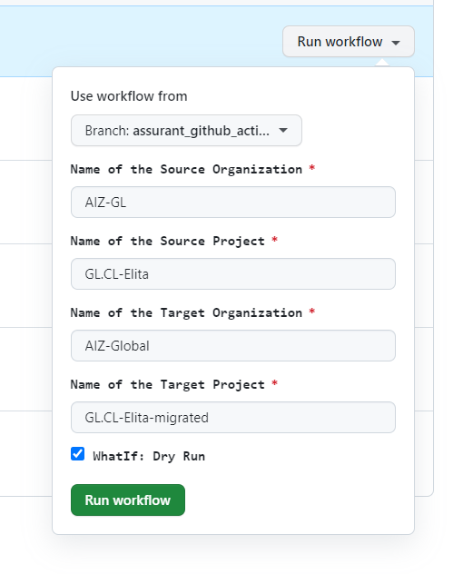
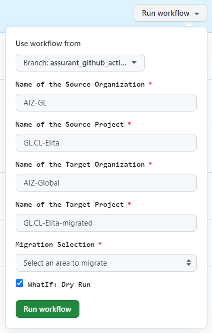
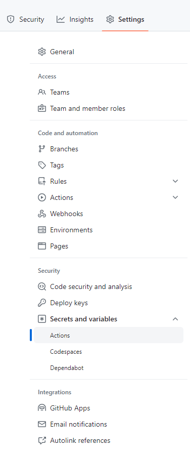
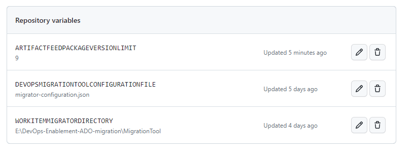
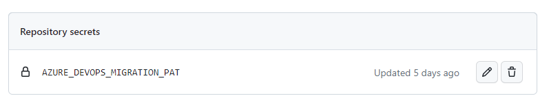

# Migration through GitHub Action Workflows
There are three GitHub Action Workflows to for ADO project migration using the Project Migration scripts outlined in the "README - Project Migration.md" file. 

These Workflows are outlined below:

## "Run ADO Organization User Migration"
Use this Action Workflow in order to migrate Azure DevOps organization level users from a Source organization to a Target organization.
Fill in the input boxes with the Source and target information and run the workflow. 

***Please Note:***  
On all of the workflows there is a "Whatif" checkbox input option which allows you to run a Dry Run to test connectivity to the powershell scripts.
No data will actually be migrated if the WhatIf checkbox is checked.

## "Run Full ADO Project Migration"
The Full Run Action Workflow is used to process a FULL ADO project to Project migration. This will perform all of the migrations scripts described in the "README - Project Migration.md" file.
The process is run in consecutive steps which provide the correct sequence for dependencies. 

## "Run Partial ADO Project Migration"

The last Action Workflow is the Partial migration. Use this to re-run sections of a full migration. This workflow will be used to do delta-backflow migrations in areas such as work-items and also for testing and correcting any migration issues. Each of the areas of migration are contained in a drop-down selection box labeled "Migration Selection". Use this input option to select the area that you would like to migrate separately. 

## Settings for the GitHub Action Workflows

### Variables
There are a few variables that each of the workflows share. These variables are define under the Settings tab for the repository. 

Under "Secrets and Varables" for Actions there are bth Variables and Secrets defined. 

The following three variables need to be defined here for the migration process to function. 
- DEVOPSMIGRATIONTOOLCONFIGURATIONFILE    = The name of the configuration file for the Azure DevOps Migration Tool (Martin's Tool). The default value is "migrator-configuration.json". 
- WORKITEMMIGRATORDIRECTORY               = The file path on the server where the GitHub Action Workflow runner can fine the Azure DevOps Migration Tool (Martin's Tool) executable. 
- ARTIFACTFEEDPACKAGEVERSIONLIMIT         = An integer value representing the maximum number of Artifact Feed Package versions to migrate. Default is -1 which tells the migration script to migrate all package versions. 

### Secrets
There is one required secret that needs to be defined here for the migration process to run. This is the Personal Access Token that the process will use to make calls to the Azure DevOps REST API. 
The Token name is AZURE_DEVOPS_MIGRATION_PAT and should contain a token that has access to both Source and Target projects and has "Basic + Test Plans" licensing access.

